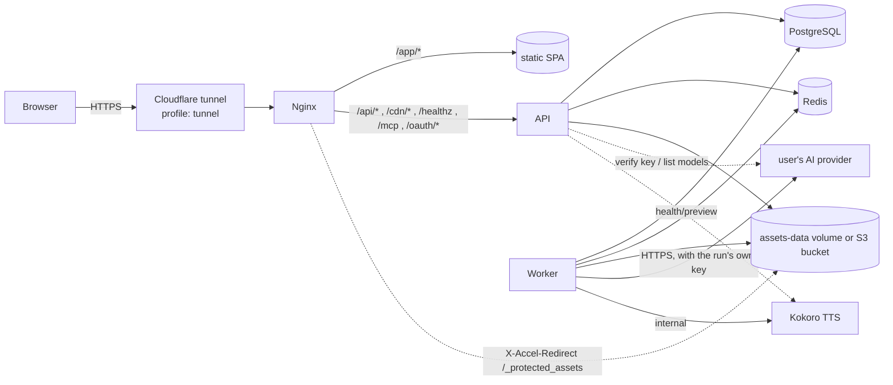

# Architecture

## Runtime topology (one VPS, Docker Compose)

Services: `nginx` (public entry, SPA, SSE passthrough, asset serving), `api` (Hono), `worker` (BullMQ processors,
compositor, exports), `migrate` (one-shot migrations, reference data, credential re-encryption), `postgres`, `redis`,
`kokoro` (profile `tts`), `mock-ai` (profile `mock`), `cloudflared` (profile `tunnel`). Postgres, Redis, Kokoro, the
worker and mock-ai are never published on host ports; only nginx binds one, on loopback by default.

The API also serves the MCP endpoint for AI agents (`/mcp`, with its OAuth authorization server under `/oauth/` and
`/.well-known/oauth-*`) and unauthenticated reader links under `/api/public/shares/`; see `docs/MCP.md` and
`docs/SECURITY.md`.

There are **no server-level provider keys**: the outbound HTTPS calls above carry a key the requesting user added, so
the API and worker images hold no shared credential. See `docs/AI_PIPELINE.md`.

YouTube stats are the one other outbound path: with the instance's own Google OAuth client configured, the API and
the worker's hourly `youtube` maintenance pass call Google's Data, Analytics and Reporting APIs with tokens of the
channels users connected (`packages/services/src/youtube.ts`, every call behind the `YouTubeClient` interface, faked
under `AI_MOCK_MODE`). See `docs/DEPLOYMENT.md#youtube-stats`.

## Request → job → event flow

Take `POST /api/panels/:id/generate` as the example; every queued AI operation follows the same steps. (An expert
chat reply is the exception: the API writes it in the background in its own process and streams it over SSE,
`GET /api/expert-chats/:id/stream`.)

1. **API, synchronously** (`apps/api/src/routes/*`): validate the body with Zod, run the permission gate
   (`projectAccess`), check the server's monthly ceiling and the project budget (`assertBudget`, 402 `instance_budget_exceeded` /
   `budget_exceeded`), validate the run's
   provider/model choice against the caller's own credentials (`apps/api/src/lib/ai.ts`, 422 `credentials_required`
   when there is none), then let `GenerationPlanner` (`packages/services/src/planner.ts`) load the immutable versions,
   compile the prompt, select references and create their small derivatives.
2. **One transaction**: insert `generation_jobs`, its `generation_inputs` rows and an `outbox` row
   (`addToOutbox`), then return `202 { job }`. Nothing is enqueued outside the transaction, so a job and its
   intent-to-publish either both exist or neither does.
3. **`OutboxDispatcher`** (`packages/queue/src/index.ts`) publishes pending rows to BullMQ with
   `jobId = generation job id`. It runs as a loop in the worker every second and is also flushed by the API right
   after commit (`jobs.kick()`) so the queue latency is not a second. The select is
   `... where status = 'pending' order by created_at limit 100 for update skip locked`, so several processes can
   dispatch at once, and because BullMQ dedupes by `jobId` a crash between publishing and marking just republishes the
   same job.
4. **Worker** (`apps/worker/src/main.ts`, `processors.ts`, `handlers/*`): one BullMQ worker per queue, each with its
   own concurrency. `runGenerationJob` (`apps/worker/src/lib/runner.ts`) is the shared lifecycle — idempotent start,
   attempt counting, cancellation checks before and after the provider call, retry classification (a
   `ProviderError` decides whether it is retryable; anything else becomes an `UnrecoverableError` so BullMQ stops),
   safe failure messages and event emission.
5. **Result**: new assets plus `generation_outputs` and `ai_usage` rows, activated in a transaction that re-checks
   cancellation — cancelled output is stored but never activated — and then published on Redis pub/sub
   (`EventBus`, channel per project).
6. **SPA**: the API streams project events over SSE (`GET /api/projects/:id/events`, one dedicated Redis subscriber
   connection per stream, keep-alive ping every ~15 s, `x-accel-buffering: no`); the client invalidates the affected
   TanStack Query keys.

Queues and what they carry:

| Queue | Work | Concurrency env |
| --- | --- | --- |
| `text-ai` | story analysis, rewrite, chapter/shot planning, page prompts, narration text, panel check, image description, YouTube package text, story bible extraction, continuity checks | `TEXT_WORKER_CONCURRENCY` (4) |
| `image-generation` | references, panels, covers, video thumbnails | `IMAGE_WORKER_CONCURRENCY` (24) |
| `image-edit` | masked edits | `IMAGE_EDIT_WORKER_CONCURRENCY` (6) |
| `tts` | narration synthesis | `TTS_WORKER_CONCURRENCY` (4) |
| `export` | every export kind except video (pages, PDF, webtoon, EPUB/CBZ, ZIP packages, audio, YouTube package) | `EXPORT_WORKER_CONCURRENCY` (1) |
| `render` | video renders (`video_pages`, `video_panels`, `video_shorts`) and project import, so an hour-long render never holds up a PDF | `RENDER_WORKER_CONCURRENCY` (1) |
| `image-batch` | submitting a bulk run's image or text jobs to a provider's batch API | fixed at 1 |
| `asset-processing` | thumbnail and prompt-reference jobs; nothing enqueues them today (derivatives are made inline) | fixed at 2 |
| `maintenance` | the hourly cleanup cycle, and the provider-batch poll every `BATCH_POLL_INTERVAL_SECONDS` (300) | fixed at 1 |

A worker consumes every queue unless `WORKER_QUEUES` lists some (comma-separated), which is how a second worker
container takes only `render` (see `docs/DEPLOYMENT.md`). Every worker also runs the outbox publisher and the
reconcile loop below; both are safe to run more than once.

BullMQ jobs default to 3 attempts with exponential backoff (5 s, jitter 0.5) under the Redis key prefix `om`. The
worker also re-publishes `queued` jobs whose Redis entry has disappeared, 15 s after start and every 5 minutes, so a
Redis flush or restore never strands work, and touches `/tmp/worker-heartbeat` (inside its own container) every 30 s for its health check.

## Production runs

A production run (`production_runs`, `apps/api/src/lib/production.ts`) drives the whole pipeline for a project —
analysis, references, chapter plans, prompts, art, narration, audio, thumbnail, YouTube text, render, YouTube package
export — one step at a time. It adds no new job machinery: each step calls the same routes a person would, through an
**in-process Hono router** that mounts the normal `/api` routes (`mountApiRoutes`) with the run's starting user set on
the context. That router is not the MCP router and has no session, CSRF or rate-limit middleware; every call still
goes through `projectAccess`, `assertBudget` and the credential checks, so the steps queue ordinary jobs through the
outbox as above.

The run is advanced **in the API process**: `POST /api/projects/:projectId/production-runs` and
`POST /api/production-runs/:id/continue` advance it at once, and `server.ts` calls `tickProductionRuns` every 10 s for
every run in `running`. Each pass finishes steps whose generation, audio or export jobs are done, starts the next,
and stops at a review step (`waiting`), a job still in flight, a failure (`failed`), or a 402 from the budget
(`paused`, so raising the cap and continuing picks up at the same step). A step looks only at what exists
(`onlyMissing`, chapters without pages, and so on), so a restarted API resumes where the row stood. Concurrent
passes on one run are prevented by a **lease on the row**: a pass claims it atomically
(`UPDATE … SET lease_owner = $me, lease_until = now() + 2 min WHERE status = 'running' AND (lease_until IS NULL OR
lease_until < now() OR lease_owner = $me)`), extends it every 30 s and on every save, writes only while it still holds
it and the run is still `running` (so a run stopped meanwhile stays stopped), and releases it when it returns. `$me`
is the process id plus a per-pass suffix, so a timer tick and a Continue click in one process exclude each other too,
and API replicas are safe. Every change publishes a
`production.updated` project event (`{runId, status}`) on the usual `EventBus`.

**Update production.** `GET /api/projects/:projectId/staleness` (`pipelineStaleness` in `packages/services`) reports
what is out of date stage by stage along story → plan → prompts → art → narration → audio → render: a story revised
after the applied analysis, chapters without a plan or whose text changed after they were planned, pages without
prepared prompts, panels without artwork or whose spec was edited after their artwork, chapters without narration or
whose panels changed after it was written, segments without current audio, and a whole-project video older than
anything it is drawn from. "Changed after" is a **source fingerprint** on the chapter (`plan_fingerprint`,
`narration_fingerprint`, migration `0033`): an md5 of what the plan or narration is made from (the chapter text the
planner reads; the panels, beats and dialogue the narration prompt reads), recorded by the plan applier and the
narration writer and compared in SQL (`planSourceFingerprint` / `narrationSourceFingerprint`). A run started with `{ update: true }` is the same machinery with fewer
steps: from the first stale stage on (each stage is made from the ones before it), skipping the thumbnail and YouTube
text; its art step also redraws the edited panels. The render then reuses every unchanged section
(see `docs/VIDEO_EXPORT_REFERENCE.md`).

**A revised story.** When the latest story revision is newer than the one the applied analysis read (`revisedStory`),
both an update and a plain run analyse it again, and the analysis review step then **always** waits, whatever the
review setting, because a re-analysis can restructure chapters and cast. The review shows
`GET /api/story-analyses/:id/diff` (`analysisDiff`): chapters kept (and whether their source text changed), renamed,
added and no longer in the story, each with its pages and drawn panels, and characters, places and props added or no
longer mentioned. The user applies it on the Story page, ticking anything to remove (the deletions then go through the
ordinary delete routes and their checks, after a confirmation that lists them), or simply continues the run, which
applies it keeping everything. Applying is additive (`applyStoryAnalysis` with `mergeChapters`): a chapter with the
same title, else an analysis-made chapter at the same position whose title is gone, is kept with its pages and gets the
new summary, beats and source text; new chapters are inserted at their place and chapters the story dropped stay where
they were; characters, places and props are matched by key or name and never changed or removed. Staleness then carries
the run on: the plan step plans the new chapters, and so on. A chapter whose text changed keeps its pages, and a run
never re-plans a chapter that has pages on its own (that replaces pages and artwork): the `review_plans` step (before
the plan step, in every run) waits with the chapters whose plan is out of date, and the person keeps each one
(`POST /api/chapters/:id/keep { stage: "plan" }` records the current fingerprint) or re-plans it (the ordinary
`POST /api/chapters/:id/plan { replace: true }`; the plan step then waits for those plans). `review_narration`, before
the narration step, does the same for narration (keep, or `narration/generate { replace: true }`). Both are skipped
when nothing is out of date.

Agents drive the same machinery through MCP (`apps/api/src/mcp/tools/production.ts`): `get_staleness`,
`start_production_run`, `update_production`, `get_production_run`, `continue_production_run`,
`cancel_production_run`, `keep_stale_chapter` and `keep_publishing_text` call these routes in-process. Starting, updating and continuing are `spend` actions, so on an
"Ask me first" connection they wait for the user's approval; stopping a run is a plain write.

## Code layout

`AGENTS.md` owns the directory-by-directory list. The shape to keep in mind:

- The API is a set of domain routers (`apps/api/src/routes/*`) that validate, authorize and enqueue. Long work never
  happens in a request.
- Business logic that both the API and the worker need lives in `packages/services` — reference selection and prompt
  compilation (`planner.ts`), applying an analysis or a plan (`apply.ts`), assets, usage, budget, jobs and outbox,
  credentials, readiness, preflight, composition. There is no second implementation on either side.
- Pure functions live in `packages/domain` (layouts, bubbles, text wrapping, narration segmentation, cost, retry
  policy, permissions, video timing), with `@openmanga/domain/browser` as the web-safe subset so the Konva editor and
  the server compositor share exactly the same geometry.

## Key design decisions

- **Structured state is the source of truth.** A panel is a document (frame, spec versions, cast versions, prompt
  override, image transform); artwork is a replaceable attachment. That is what makes regeneration, migration and
  deterministic export possible.
- **Versioning everywhere that matters:** story revisions, character/location/prop versions, project style versions,
  panel spec versions, artwork asset lineage, prompt template versions. Approved and locked versions are immutable;
  a change makes a new version.
- **Deterministic composition:** page geometry, bubble outlines (`packages/domain/src/bubbles.ts`) and text wrapping
  are shared by the editor and the server SVG compositor, so what the editor shows is what the export renders. No AI
  runs at export time.
- **Narrow provider boundaries:** `TextAIProvider`, `ImageAIProvider`, `TTSProvider`, the batch variants
  `TextBatchProvider` and `ImageBatchProvider`, `AssetStorage`, `MailProvider` and `JobQueue` are the only
  interfaces; everything else is plain code. Which implementation runs is decided per job by the credential the run
  names (`ProviderResolver`), not by server configuration — there is no provider switch to set.
- **Mocking at two levels:** in-process fakes (`AI_MOCK_MODE=true`, unit and integration tests) and `apps/mock-ai`, an
  HTTP service speaking the OpenAI-compatible chat and images wire formats, which exercises the real provider code
  including its retry and error classification. `docs/TESTING.md` has the scenario list.
